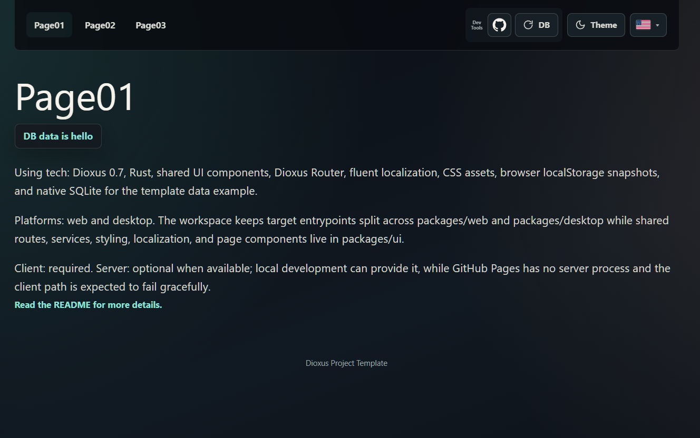
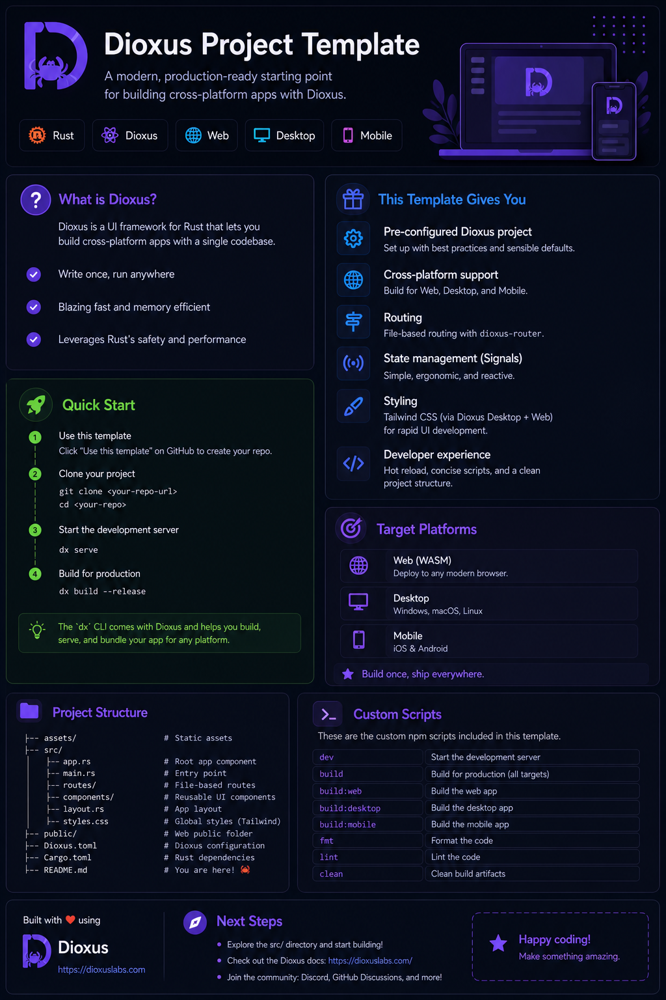

# Dioxus Bitcoin Lightning Game

Reusable Dioxus 0.7 workspace template with a shared UI crate, separate web and desktop entrypoints, three routed pages, localization, theme persistence, toast status feedback, and a small local data-cache example.

 

## Live Web App

https://samuelasherrivello.github.io/dioxus-bitcoin-lightning-game/

The static web build is exported and hosted automatically with each push to the main branch.

 

## Pics

### Screenshot

### Infographic

 

## Scripts

### Common

| Command | Required? | Description |
| ------- | --------- | --- |
| `.\Scripts\Common\InstallDependencies.ps1` | ✅ | Installs repository dependencies and builds Tailwind CSS output. |
| `.\Scripts\Common\RunWeb.ps1` | ✅ | Stops this repo's Dioxus web/static server and generated app server, then starts a fresh web app at `http://localhost:8080` for Polar bridge compatibility and opens it in the default browser. Use `-NoOpen` to skip browser launch. |
| `.\Scripts\Common\StopWeb.ps1` | ❌ | Stops the Dioxus web server and generated game server for the requested port. |
| `.\Scripts\Common\RunDesktop.ps1` | ✅ | Starts the desktop app with Dioxus desktop. |

`http://localhost:37373` is Polar's local MCP bridge, not the Dioxus app. Open the app at `http://localhost:8080` when using Polar Automation so browser calls to Polar's bridge pass its localhost CORS check. `RunWeb.ps1` restarts the Dioxus development servers on every run; if the requested port is owned by another process such as Polar, Docker, or an LND node, the script reports that owner instead of stopping it. For phone or offline mock testing, pass `-Address <this laptop's Wi-Fi IPv4>`; networked Polar bridge calls may reject that non-localhost browser origin.

### Other

| Command | Required? | Description |
| ------- | --------- | --- |
| `.\Scripts\Other\RunTests.ps1` | ❌ | Runs UI crate tests. |

 

## Architecture

| Path | Description |
| ---- | ----------- |
| [`packages/ui`](./packages/ui) | Shared Dioxus UI crate split into routed pages, components, models, client services, assets, and tests. |
| [`packages/web`](./packages/web) | Web entrypoint, favicon, generated Tailwind CSS, and web CSS. |
| [`packages/desktop`](./packages/desktop) | Desktop entrypoint, generated Tailwind CSS, and desktop CSS. |

The shared UI crate owns the app shell, routes, toast region, developer tools, localization, theme persistence, and the generic template data example.

The current cache path is static-host friendly: browser builds use a localStorage snapshot, while non-wasm builds use native SQLite under local `data/`. First-time SQLite schema creation and seed data live in `create_database_if_missing()` in the database service.

 

## Dioxus Features

See [`Documentation/DioxusFeatureMatrix.md`](./Documentation/DioxusFeatureMatrix.md) for current Dioxus feature usage, platform support, and future extension ideas.

 

## Github Features

Keep [`.github/workflows/export-web-build-to-github-pages.yml`](./.github/workflows/export-web-build-to-github-pages.yml) as the only GitHub Pages deployment workflow. Do not create a branch-based Pages action; it can fight with this custom export workflow.

Choose one setup option:

| Option | Instructions |
| ------ | ------------ |
| Enable Pages manually | In GitHub, open `Settings > Pages` and set `Source` to `GitHub Actions`. Do not select a branch source. |
| Add `PAGES_ADMIN_TOKEN` | Add a repository secret named `PAGES_ADMIN_TOKEN` with Pages write permission so the workflow can enable or repair Pages setup without creating another action. |

The GitHub Actions display name is `ExportWebBuildToGithubPages`.

 

## Codex Features

This repo includes optional but recommended [Codex](./.codex/README.md) context and [Spec Kit](./.specify/README.md) workflows so agent prompts can stay short and consistent.

| File | Purpose |
| ---- | ------- |
| [`AGENTS.md`](./AGENTS.md) | Dioxus 0.7 rules and project workflow instructions for agents. |
| [`.aiignore`](./.aiignore) | Common AI-agent ignore file for build output, runtime data, test artifacts, logs, and dependency caches. |
| [`.agents/skills/`](./.agents/skills) | Spec Kit skills for Codex, invoked as `$speckit-constitution`, `$speckit-specify`, `$speckit-plan`, `$speckit-tasks`, and related commands. |
| [`.codex/rules/`](./.codex/rules/frontend-design.md) | Frontend design and Dioxus workflow guidance for this template. |
| [`.codex/skills/`](./.codex/skills/dioxus-bitcoin-lightning-game/SKILL.md) | Project-specific skill guidance for Dioxus, cache, and verification work. |
| [`.specify/`](./.specify) | Spec Kit project configuration, constitution, PowerShell workflow scripts, and templates. |
| [`specs/`](./specs) | Feature specifications, starting with the template baseline spec. |

 

## Credits

**Created By**

- Samuel Asher Rivello
- Over 25 years XP with game development (2025)
- Over 10 years XP with Unity (2025)

**Contact**

- Twitter - [@srivello](https://twitter.com/srivello)
- Git - [Github.com/SamuelAsherRivello](https://github.com/SamuelAsherRivello)
- Resume & Portfolio - [SamuelAsherRivello.com](https://www.SamuelAsherRivello.com)
- LinkedIn - [Linkedin.com/in/SamuelAsherRivello](https://www.linkedin.com/in/SamuelAsherRivello)

**License**

Provided as-is under [MIT License](./LICENSE) | Copyright (c) 2006 - 2026 Rivello Multimedia Consulting, LLC
